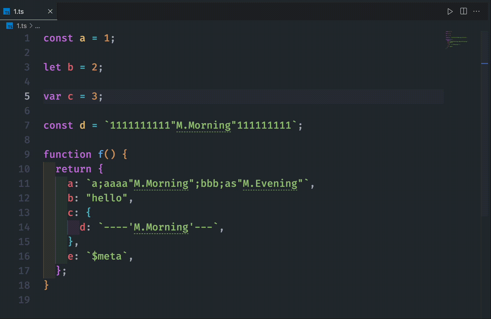

# Turboui-i18n

基于 @turboui/turbo-ui-sdk 的国际化扩展，对国际化配置文件中提供的国际化字段进行特殊标注，鼠标移入时，可查看对应的国际化语言。

## 配置

默认情况下，扩展会对当前工作区中所有 `i18n` 目录（可能有多个）下的 `.json` 文件用作关键词配置。比如，`.json` 文件内容如下：

```json
{
  "M.Morning": {
    "zh-CN": "早上好",
    "en-US": "Good morning"
  },
  "M.Evening": {
    "zh-CN": "晚上好",
    "en-US": "Good evening"
  }
}
```

鼠标移入时，弹出悬浮框，点击关键词跳转至关键词所在文件及位置。



可以在 `setting.json` 中自定义 `.json` 文件目录，以及自定义需要在哪些类型文件中触发插件提示。默认是在 `.js` 与 `.ts` 文件中自动触发提示。

```json
{
  "turboui-i18n.configDirName": "i18n",
  "turboui-i18n.includes": [".js", ".ts"],
  "turboui-i18n.exclude": []
}
```
