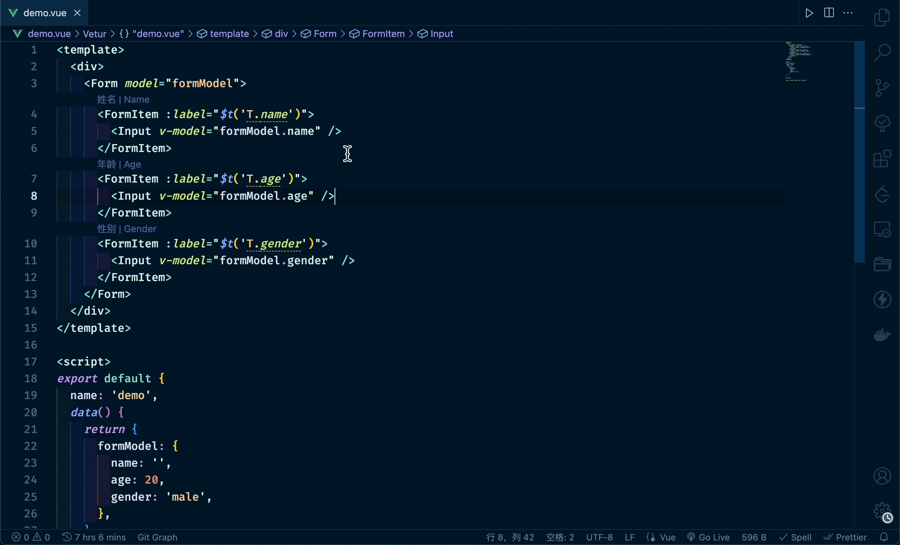
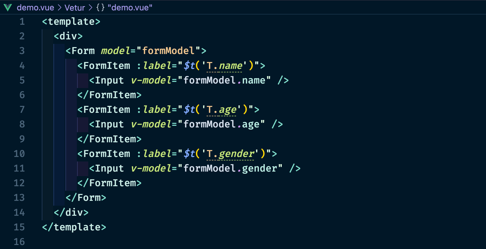
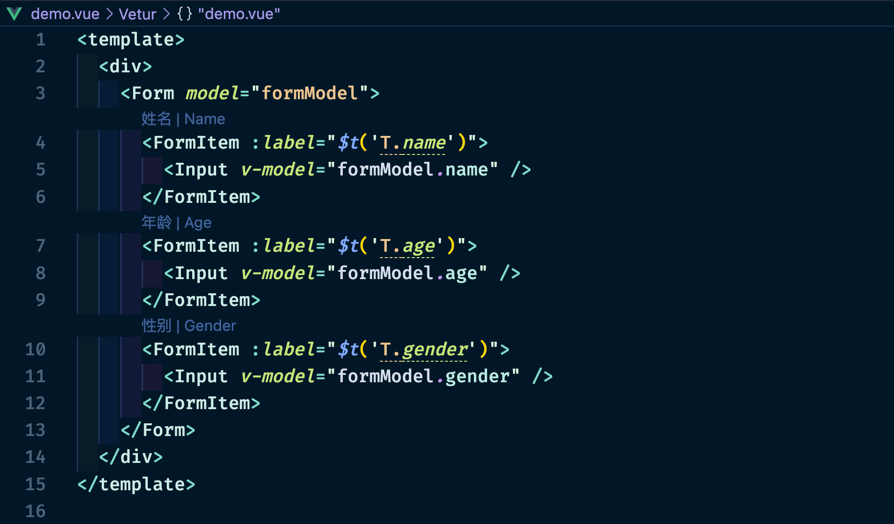

# Ti18n

一个国际化字段便捷提示插件，对国际化配置文件中提供的国际化字段进行特殊标注，鼠标移入时，弹出悬浮框，可查看对应的国际化语言。点击悬浮框中的关键词，可跳转至关键词所在文件及位置。



## 配置文件格式

支持三种不同格式的国际化配置文件，且都为 `.json` 格式。

### 格式一

各语言都配置在同一字段下。

```json
{
  "T.name": {
    "zh_CN": "姓名",
    "en_US": "Name"
  },
  "T.age": {
    "zh_CN": "年龄",
    "en_US": "Age"
  },
  "T.gender": {
    "zh_CN": "性别",
    "en_US": "Gender"
  }
}
```

### 格式二

各语言都配置在对应的语言字段下。

```json
{
  "zh_CN": {
    "T.name": "姓名",
    "T.age": "年龄",
    "T.gender": "性别"
  },
  "en_US": {
    "T.name": "Name",
    "T.age": "Age",
    "T.gender": "Gender"
  }
}
```

### 格式三

各语言分别配置在不同的文件中。

- `zh_CN.json`

  ```json
  {
    "T.name": "姓名",
    "T.age": "年龄",
    "T.gender": "性别"
  }
  ```

- `en_US.json`

  ```json
  {
    "T.name": "Name",
    "T.age": "Age",
    "T.gender": "Gender"
  }
  ```

## 配置项

默认配置：

```json
{
  "ti18n.enable": true,
  "ti18n.configDirs": ["i18n", "locale"],
  "ti18n.extFiles": [".js", ".jsx", ".ts", ".tsx", ".vue"],
  "ti18n.exclude": [],
  "ti18n.shortcutLanguages": [],
  "ti18n.shortcutLanguageMaxLength": 10
}
```

### enable

Type: `boolean`

Default: `true`

启用或禁用插件。

### configDirs

Type: `Array<string>`

Default: `["i18n", "locale"]`

存放国际化配置的文件夹名。

### customLanguages

Type: `Array<string>`

Default: `[]`

自定义的语言列表。针对配置文件类型为 [格式二](#格式二) 时，会先根据插件内部的国际化语言列表：`zh_CN, zh_TW, zh_HK, en_HK, en_US, en_GB, en_WW, en_CA, en_AU, en_IE, en_FI, fi_FI, en_DK, da_DK, en_IL, he_IL, en_ZA, en_IN, en_NO, en_SG, en_NZ, en_ID, en_PH, en_TH, en_MY, en_XA, ko_KR, ja_JP, nl_NL, nl_BE, pt_PT, pt_BR, fr_FR, fr_LU, fr_CH, fr_BE, fr_CA, es_LA, es_ES, es_AR, es_US, es_MX, es_CO, es_PR, de_DE, de_AT, de_CH, ru_RU, it_IT, el_GR, no_NO, hu_HU, tr_TR, cs_CZ, sl_SL, pl_PL, sv_SE, es_CL` 进行处理，如果要使用的语言不在上述列表中，请自行添加。

比如，需要使用新语言 `zh_HENAN`，配置文件为：

```json
{
  "zh_CN": {
    "T.comfortable": "舒服",
    "T.good": "好",
    "T.deliberately": "故意的"
  },
  "zh_HENAN": {
    "T.comfortable": "展劲",
    "T.good": "俏巴",
    "T.deliberately": "巴巴滴"
  }
}
```

则需要在 `.vscode/settings.json` 中配置：

```json
{
  "ti18n.customLanguages": ["zh_HENAN"]
}
```

### extFiles

Type: `Array<string>`

Default: `[".js", ".jsx", ".ts", ".tsx", ".vue"]`

生效的文件类型。

### exclude

Type: `Array<string>`

Default: `[]`

忽略的文件夹或文件。

### shortcutLanguages

Type: `Array<string>`

Default: `[]`

可展示的快捷语言类型，默认不展示。如果想更直观地看到当前国际化字段对应的值，可以设置该属性。

默认展示效果如下：



设置如下配置：

```json
{
  "ti18n.shortcutLanguages": ["zh_CN", "en_US"]
}
```

展示效果如下：



点击后，可以快速跳转到对应配置文件所在的位置。

### shortcutLanguageMaxLength

Type: `number`

Default: `10`

Minimum value: `3`

快捷语言提示的最大文本长度。
